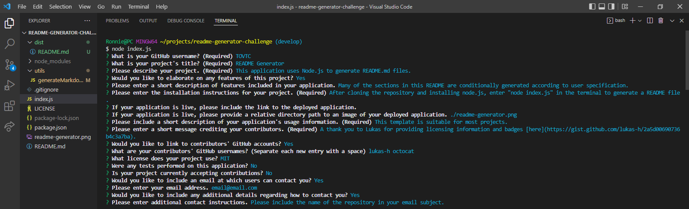

  # README Generator
  This application uses Node.js to generate README.md files. 
   
  
  ## Table of Contents
  * [Features](#features)
  * [Installation](#installation)
  * [Usage Information](#usage)
  * [Authors & Acknowledgements](#credits)
  * [License](#license) 
  * [Contact](#questions)
  
  ## Features
  Many of the sections in the README file are conditionally generated according to user specification.
    
  ## Installation 
  After cloning the repository and installing Node, enter "node index.js" in the terminal to generate a file.
  
  ## Usage Information
  
  This template is suitable for most projects.
   
    
  ## Authors & Acknowledgements
  Special thanks to the following contributors: 
    [octocat](https://github.com/octocat) 
    [lukas-h](https://github.com/lukas-h) 
    
  A thank you to Lukas for providing licensing information and badges [here](https://gist.github.com/lukas-h/2a5d00690736b4c3a7ba).
  
  Made by [TOVTC](https://github.com/TOVTC)
  
  ## License
  This application uses the MIT License. For more information regarding usage, please visit [this link]("https://opensource.org/licenses/MIT")

  ## Questions?
  Contact repository author via [GitHub](https://github.com/TOVTC)